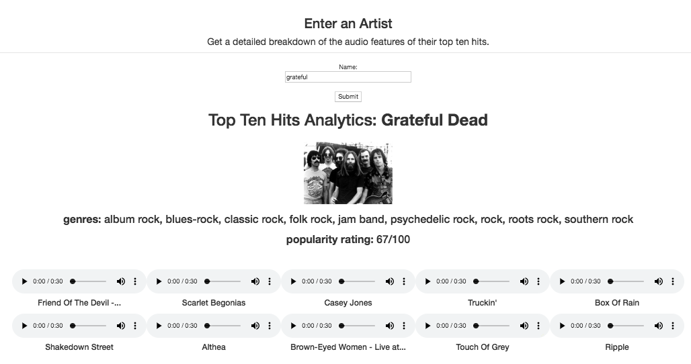
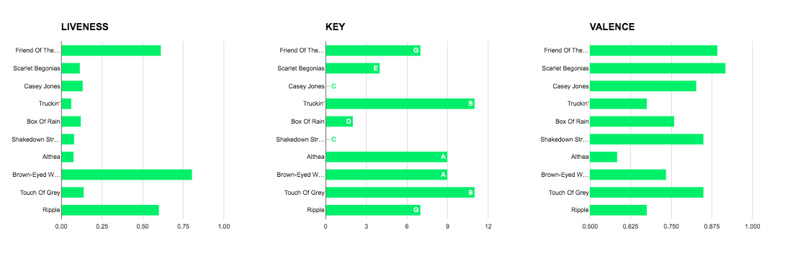

# Spotify Top Ten Hits Frontend
A frontend Spotify utility where you can enter any artist in the search field and get a report of
the audio features – acousticness, danceability, energy, musical key, tempo, etc. –
of their top ten hits, with downloadable previews, as well as their genre and
popularity.

## Files
* main.py 
* generatehtml.py

## Downloading
```
$ git clone https://github.com/priyasundaresan/spotify-frontend
```

## Dependencies
spotipy – a Python library for the Spotify Web API
```
$ pip install spotipy
```
## Running the Program
First, in main.py, line 11, edit the following lines with your client ID and client secret which can be found [here](https://developer.spotify.com/dashboard/applications):
```
client_credentials_manager = SpotifyClientCredentials(client_id='YOUR CLIENT ID HERE',
                                                      client_secret='YOUR CLIENT SECRET HERE')
```
Navigate into the folder containing main.py and generatehtml.py, and run:
```
$ python3 main.py
```
Go to http://localhost:8000/ and search for any number of artists using the form. Keyboard interrupt in Terminal to kill the server and exit the session. 



